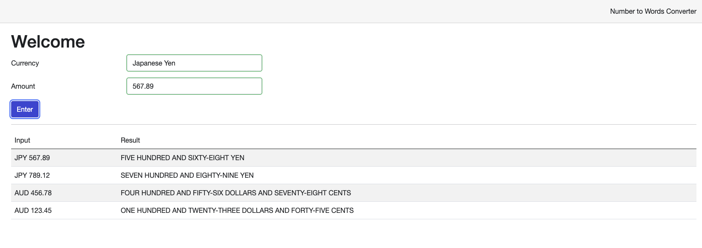
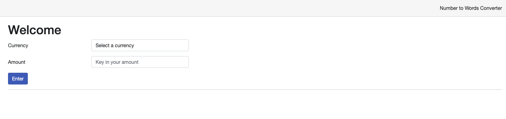
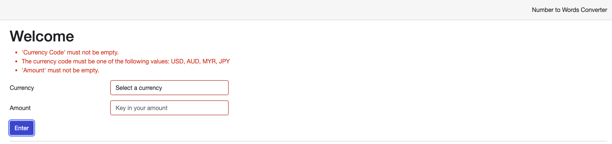
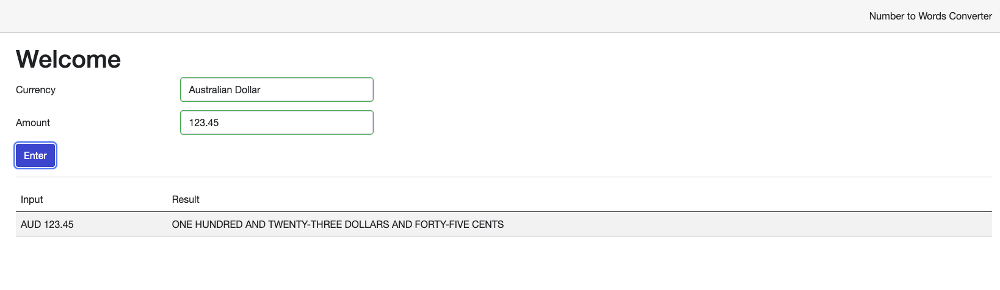
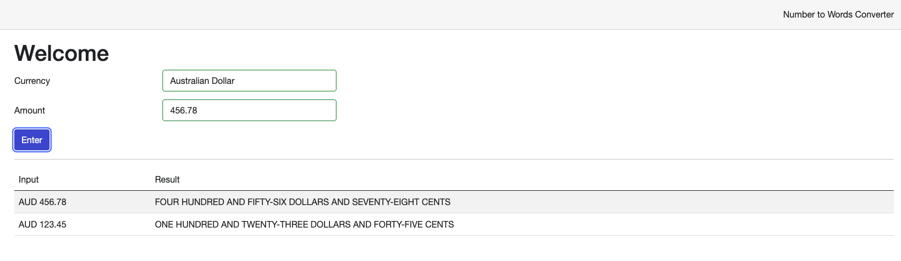
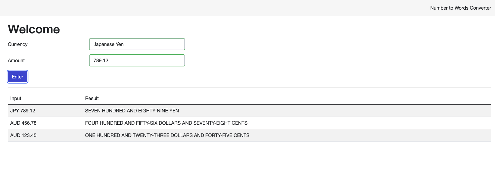

# Tools.NumberToWordsConversion

The number to words conversion tool is a blazor web application that convert a numerical input
into words and display the conversion result on the web page.



## Prerequisite

- [Install .NET on Windows, Linux, and macOS](https://learn.microsoft.com/en-us/dotnet/core/install/)
- [Install docker engine](https://docs.docker.com/engine/install/)

## Get started

There are 2 ways to build and host this web application on your local, before build the application, ensure to generate
a developer certificates by running the following command on your terminal:

- For Windows user:

   ```pwsh
   dotnet dev-certs https -ep $env:USERPROFILE\.aspnet\https\aspnetapp.pfx -p password
   dotnet dev-certs https --trust
   ```

- For macOS or Linux user:

    ```zsh
    dotnet dev-certs https --trust -ep ~/.aspnet/https/aspnetapp.pfx -p password
    ```

### Build and host with dotnet sdk

1. Open your terminal, and clone the repository to your device.
    ```zsh
   git clone {the repository link} 
   ```
2. Switch the directory to the root folder of this repository with the following command.
    ```zsh
    cd Tools.NumberToWordsConversion
   ```
3. Use the dotnet sdk to run the project with the following command.
    ```zsh
    dotnet run --project=./Tools.NumberToWordsConversion.Web/Tools.NumberToWordsConversion.Web.csproj
    ```
4. Open your browser, and navigate to [this link](http://localhost:5147).

### Build and host with Docker

1. Open your terminal, and clone the repository to your device.
    ```zsh
   git clone {the repository link} 
   ```
2. Switch the directory to the root folder of this repository with the following command.
    ```zsh
    cd Tools.NumberToWordsConversion
   ```
3. On the root folder of this repository, create all the necessary containers in your Docker by running the command
   below. You may expect some exceptions thrown on the app container.
    - For macOS or Linux user, run `docker compose up`.
    - For Windows user, run `docker compose up -f .\compose.windows.yaml`.
4. Open your browser, and navigate to [this link](http://localhost:5147).

## Introduction to the web app

### Features

The application takes in 2 input: the currency, and the amount. 

User can choose USD, AUD, MYR or SGD as the currency option, and provides an input of the amount 
up to Octillion, that is 10 to the power of 27.



If the user doesn't choose any currency option, or doesn't key in the amount, when the user press the `Enter` button,
inline errors will be shown on the top of the input fields.



If there are no issue, when the user press the `Enter` button, the conversion result will be display in a table view 
at the bottom of the input fields.



The latest conversion result will be place at the top of the table.



If the chosen currency doesn't have any subunit, for example JPY, the application will round up
the decimal point to 0.



### Limitation of the web app

Currently, it only supports USD, AUD, MYR and SGD as the currency input. Due to the limitation of C# decimal,
it currently only supports up to Octillion, that is 10 to the power of 27.

## Additional information

This repo also consists of the test plan and design rationale documents for this project.

## Who do I talk to?

Please speak to [OneJackLee](mailto:charliewanj@outlook.com) should you have any issue.